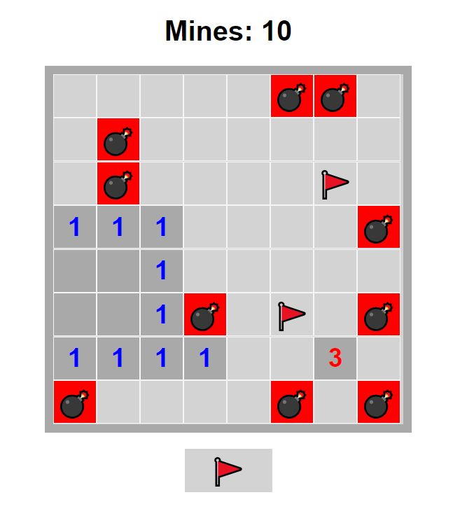

## Minesweeper: A Classic Logic Game

##### This JavaScript code brings the beloved Minesweeper game to life in your web browser! Test your luck and deduction skills as you strategically uncover tiles, avoiding hidden mines and revealing numbers that represent nearby mines.

### Features:

- Random Mine Placement: Mines are randomly placed on the board at the start of each game, ensuring a fresh challenge every time.
- Tile Flagging: Mark suspicious tiles as potentially containing mines using the flag button.
- Numbered Tiles: Uncovered tiles display a number indicating the number of neighboring mines, aiding your strategic decisions.
- Victory and Defeat States: The game congratulates you when all safe tiles are revealed, or alerts you if you hit a mine.
- Customizable Difficulty: Modify the number of mines and board size (rows and columns) for a personalized experience. (Optional: Provide instructions in the code for customization)

### Run the Game:

- Open the minesweeper.html file in your web browser.
- Left-click a tile to uncover it. Right-click a tile to place a flag.

### Code Breakdown

1. HTML (minesweeper.html):

- Defines the basic structure of the game board, including a display for the remaining mine count ("Mines: 0") and a flag button.
- Uses JavaScript to dynamically create the game board tiles within the div element with the ID "board".

2. JavaScript (minesweeper.js):

- Calls functions to set up the mines, create the game board, and add click event listeners to tiles and the flag button.
- setMines: Randomly places the specified number of mines on the game board, storing their coordinates in the minesLocation array.

### startGame:

- Sets the initial mine count display.
- Adds a click event listener to the flag button for enabling/disabling flag placement mode.
- Creates a two-dimensional array (board) to represent the game board tiles.
- Iterates through rows and columns to dynamically create tiles using JavaScript's - DOM manipulation.
- Assigns click event listeners to each tile, calling the clickTile function when clicked.
- setFlag: Toggles the flag button's functionality and appearance based on whether flag placement mode is enabled or disabled.
- clickTile: Handles left and right-clicks on a tile:
- Checks for game over or previously clicked tiles to prevent redundant actions.
- If in flag placement mode (right-click), toggles a flag on the tile.
- If left-clicking a safe tile:
- Reveals the tile's content (number or blank).
- Checks surrounding tiles for mines, recursively calling checkMine to reveal a chain of safe tiles.
- If left-clicking a mine, reveals all mines and displays a game over message.
- revealMines: Iterates through all tiles, revealing any hidden mines and marking them visually.
- checkMine: Recursively checks a tile's surroundings:
- Handles out-of-bounds conditions and previously clicked tiles.
- Reveals the current tile's content (number or blank).
- If the tile has a number, the function stops recursion.
- If the tile is safe, recursively checks the surrounding eight tiles for mines.
- checkTile (helper function): Checks if a specific tile coordinate contains a mine, returning 0 (safe) or 1 (mine).

### Customization (Optional):

- Modify the initial values of rows, columns, and minesCount in the JavaScript code to adjust the game board size and difficulty.
- Consider adding comments within the code to explain specific sections and functions for better readability.

